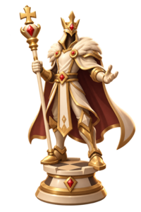

# ♟️ 3D Web3 Chess

<p align="center">

</p>

A fantasy-themed **3D chess game** combining classic chess gameplay with Web3 and digital ownership.

## 🎮 MVP

The MVP focuses on the core experience:

- 3D fantasy chess board
- Fantasy chess pieces
- Player vs Player chess
- Standard chess rules
- Basic matchmaking
- Basic player ranking
- Web3 wallet connection
- EVM / multi-chain support


## 🏰 Game Style

The game uses a **fantasy 3D art style**, with unique characters representing each chess piece.

Future content may include:

- Different chess piece sets
- Collectible boards
- Fantasy arenas
- Skins and cosmetics
- Special events


## Installation

### Prerequisites

- Node.js 20.x or higher
- npm or yarn

### Steps

```bash
# Clone the repository
git clone https://github.com/0xchess-game/mvp.git

# Navigate to the project folder
cd mvp

# Install dependencies
npm install

# Start the application
npm start
```

## 📌 Status

**MVP — In Development**

---

**3D Chess. Fantasy Battles. Web3 Ownership. ♟️**
